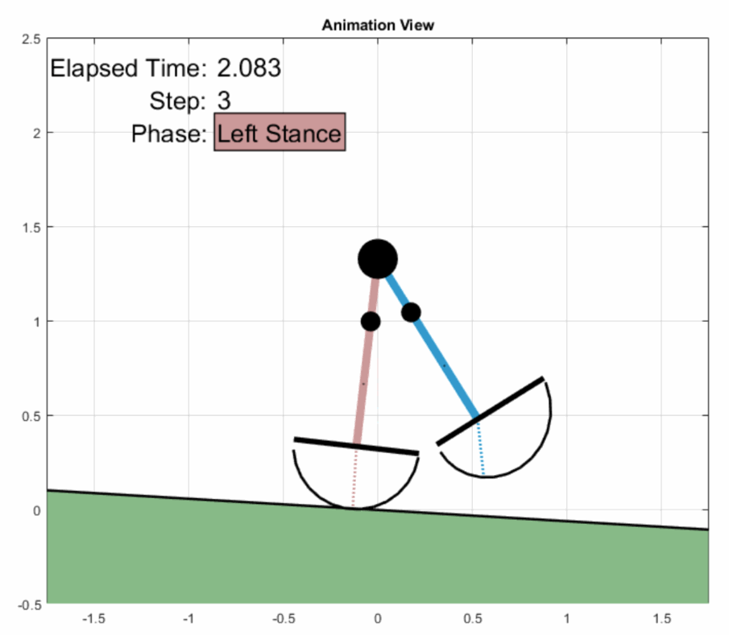

<h1 align="center">Passive Dynamic Walker (PDW) Simulation Model</h1>
<h2 align="center">Compass Gait (2-Link)<br/>5-mass<br/>Asymmetric<br/>Variable Foot Shape Radius</h2>

<p align="center"></p>


A passive dynamic walker (PDW) is a biped robot that does not draw energy from any supply (ie. batteries, gasoline, etc) and only relies on the potential energy of walking down a decline. It fundementally represents a walking human as seen from the side (sagital view), while the upper body is represented as a larger hip mass.

This PDW is a so-called compass gait, or 2-link, walking model, in that there are only two effective linkages representing the walker's system.  Essentially, this compass gait model is a inverted double-pendulum rotating about the ground contact.

While typical biped simulations rely on symmetrical leg properties such as mass and mass position, this PDW model allows the masses to be asymmetrical and to be distributed any way along the legs.  

In addition in this model it is possible to change each foot shape such that the walker rolls over its feet in a variety different ways.

The result output of this simulation model yields raw data and visual plots that include:
 - Kinetic, Potential, and Total Energy
 - Ground Reaction Forces
 - Leg Trajectory (Angular position, velocity, acceleration)
 - Limit Cycle Plot
 - Step Length Asymmetry'
 - Collision event information
 - and more ....


---
## :eyeglasses: Overview
* [What is This Even Good For](#grey_question-what_is_this_even_good_for)
* [Compatibility](#thumbsup-compatibility)
* [Installation](#rocket_Installation)
* [Simulation Options](#gear_Simulation_Options)
* [Walker Parameters](#walker_Walker_Parameters)
* [Run](#arrow_forward_Run)
* [Changing Variables over Multiple Runs](#control_knobs_Changing_Variables_over_Multiple_Runs)
* [Citing This Work](#heavy_check_mark_Citing_This_Work)
* [Author](#bust_in_silhouette-author)
* [Licence](#licence)


---
### :grey_question: What is This Even Good For
There are a few reasons why you would be interested in this walking simulation model
- **Presentation** - It looks nice and would definetly look cool when showing off MATLAB animations.
- **Walking Dyanmics Research** - If you are a researcher that is focused on walking dynamics analysis, this may be cool to mess with. The powerful about a computer simulation like this one is that you are able to quickly change walker paramters, and change them a lot, while finding interesting patterns.
- **Building a PDW** - This simulation can be a great aid of picking and experimenting with a variety of different walker paramters to predict and verify the behavior of a physical PDW.
- **Boredom** - If you don't know what you are doing with your life and happen to have MATLAB around, this is 100% for you before you go get your stuff together and get off the couch.


---
## :thumbsup: Compatibility
This PDW simulaton model was created and tested on MATLAB R2017b and R2018b on a Windows 10 operating system. Although this logger was created within those software versions and operating systems, it may work in other environments as well.

I would love to hear about usage on earlier or later MATLAB versions and other operating systems.


## :rocket: Installation
1. **Clone this repository to a computer with git.**
    - Use the ol' git machine to clone this repository to to a local directory
    - `git clone https://github.com/ismet55555/Passive-Dynamic-Walker.git`
    - Note that you don't have to use the scary terminal, you can use one of many git graphical interfaces such as [GitHub Desktop](https://desktop.github.com/)
2. **Download this repository as a _.zip_ file.**
    - Go to this repository's front page: https://github.com/ismet55555/Passive-Dynamic-Walker
    - On the right, press the green "Clone or Download" button
    - Select the "Download zip" option on the right.
    - Once downloaded, extract the .zip file on your computer


---
## :gear: Simulation Options
All simulation based options are stored in the `p` struct variable in `sim`.
For example, `p.sim.dt` will hold the simulation time step.

### General Simulation Enviroment
These settings are for the general simulation behavior.
 - `p.sim.dt` - Time Step, dt (s) - The time beteen simulation iterations.
 - `p.sim.total_strides` - Total Walker Strides - Specifies the goal of the walker. Unless the walker fails, at this number of strides the walker will stop walking.
 - `p.sim.g` - Gravity Constant (m/s^2) - The gravity constant applied to the walker.
 - `p.sim.theta` - Walking Ramp (rad) - The slope of the ramp on which the walker walks. Positive values is a decline, negative values is a incline.

### Initial Conditions
The walker's leg angular positions at the beginning of the simulation are:
 - `p.sim.init.q1` - Stance Leg angular position (rad)
 - `p.sim.init.q2` - Swing leg angular position (rad)
 
The angular velocities at the beginning of the simulation are:
 - `p.sim.init.qd1` - Stance Leg angular velocity (rad/s)
 - `p.sim.init.qd2` - Swing leg angular velocity (rad/s)

**TIP**: _To find a set of stable initial conditions, you can itereate through different parameters, then pause the model at the beginning of the left stance phase, viewing stance and swing angular positions and velocities._

### Result Output
#### Plots and Animations
Each simulation output run can produce a variety of output plots and animations.  The following options can be set to `true` if you would like to enable them. In order to turn them off, set them to `false`. The potional output plots are as follows. 
 - `p.sim.output.animation` - When this is set, the animation will show the walker as it is being simulated in an animation.
 - `p.sim.output.energy` - These plots will show the walker's kinetic, potential, and total energy over time. One plot for the entire simulation, and one per-step plot overlayed.
 - `p.sim.output.force` - These plots will show the walker's ground reaction forces in the direction along (parallel) the ramp, `Rx`, and perpendicular to the ramp, `Ry`.  One plot for the entire simulation and one per-step plot overlayed.
 - `p.sim.output.step_length` - This plot shows the step length of each step. This is particularly useful when specifying asymmteric walker parameters.
 - `p.sim.output.limit_cycle` - This shows the limit cycle plot of the walker left and right leg. A limit cycle plot shows the relation ship of the leg's angular position (`q`) and angular velocity (`qd`)
 - `p.sim.output.angle` - This option will output the angle over time and per-step for the walker's legs (`q`)
 - `p.sim.output.anglular_vel` -  This option will output the angular velocity over time and per-step for the walker's legs (`qd`)
 - `p.sim.output.angular_accel` - This option will output the angular acceleration over time and per-step for the walker's legs (`qdd`)

**Note:** _If you would like to change any of the output plots to your need, you can do so by changing them in file `\Simulation\Dependents\plot_results.m`._
**Note:** _If you are interested in an iteration of multiple simulation runs, it may be best to set all visual outputs to `false`._ 

#### Raw Data
Each walker simulation run will result in a variety of results. 
 - `p.sim.output.result_output_filename` - The file in which the simulation data text will be stored. Each simulation run yields one row of information. This is `DATA.txt` by default, however can be changed. In general all information related to anything yielded by the simulation run will be stored in the `results` struct variable (More information on that is explained below).  A specified subset of `results` is automatically stored in a specified `DATA.txt` file. This file is made such that each row is one simulation run. You may add or remove the paramters saved into this file, by adjusting the file `\Simulation\Dependents\save_parameters.m`
 - `p.sim.output.save_plots` - Saves any specified output plots. _(Under construction for now, however you can manually save each plot using the common `Save as ...`)_
 - `p.sim.output.results_dir` - The directory into which the data text file will be saved.


## :walking: Walker Parameters
### Masses and Mass Positions
This passive dynamic walker simulation model has the ability to be defined asymmetrically in its masses and mass positions along the walker's legs. There are two masses per leg, while one single mass defines the hip.  The two masses along each leg can be distributed in any way along the leg for each side.

The paramters are defined as show in the figure below:
<p align="center">[Insert Figure Here]</p>

### Foot Shape
This model is unique because it is possible to alter the foot shape (or roll over shape) of either foot. The foot shape for this model can be defined as a continous and variable radius around the walker's ankle as:

<p align="center">radius<sub>foot</sub> = angle*A + B</p>

In this equation _angle_ is the angle around the ankle in radians, _A_ is the change constant (how the foot shape changes), and _B_ is the offset constant.

In addition it is possible to offset the ankle along the top of the foot with a constant _d_ as shown in the figure below.

<p align="center">[Insert Figure Here]</p>


---
## :arrow_forward: Run
There is not much to write in this section. To fire up the damn thang, just simply run `RUN.m`.
When you do run the script the command window should look like something like this for a quick 4-stride successfull walker simulation run:
```
[18:59:26.188][INFO    ] : Simulation started
[18:59:26.250][INFO    ] : Number of strides: 4
[18:59:26.291][INFO    ] : Starting walker step sequence ...
[18:59:26.302][INFO    ] : Stride: 1 - Step: 1 - Left Stance
[18:59:29.611][INFO    ] : Stride: 1 - Step: 2 - Right Stance
[18:59:33.124][INFO    ] : Stride: 2 - Step: 3 - Left Stance
[18:59:33.616][INFO    ] : Stride: 2 - Step: 4 - Right Stance
[18:59:33.933][INFO    ] : Stride: 3 - Step: 5 - Left Stance
[18:59:34.231][INFO    ] : Stride: 3 - Step: 6 - Right Stance
[18:59:34.553][INFO    ] : Stride: 4 - Step: 7 - Left Stance
[18:59:34.984][INFO    ] : Stride: 4 - Step: 8 - Right Stance
[18:59:35.371][INFO    ] : Simulation complete
[18:59:35.373][INFO    ] : Simulation duration: 9.19s
[18:59:35.375][INFO    ] : Plotting any specified plots ...
[18:59:38.158][INFO    ] : Saving simulation data to file ...
[18:59:38.225][INFO    ] : Simulation run complete
```

### Note on Logging Options
This program utilizes a custom [MATLAB logging add-on](https://github.com/ismet55555/Logging-For-MATLAB). Essentially, this logger allows you to inspect what the program is doing, while giving you some basic troubleshooting tools. If you are interested in how to utilize thise tools, visit the [logger's page](https://github.com/ismet55555/Logging-For-MATLAB). In order to turn on any `Debug` level logging statments, in `RUN.m`, set  `log.default_level = 1`


---
## :control_knobs: Changing Variables over Multiple Runs 
In a lot of research and exploration related situations, you may be wanting to vary specific walker paramters over multiple runs. For example, you may want to see the effects on walker dynamics of moving a leg mass up the leg gradually with each simulation run. Fundementally, currently to accomplish this, you can alter the specific variable and repeatatly executing the following code block that is located in `RUN.m`. If you are running multiple and unsupervised runs of the simulatino model, it is advisted that all plotting and animation options are set to `false` (see above).

```MATLAB
%Start Simulation Timer
tic
log.info('Simulation started')
log.info(sprintf('Number of strides: %i', p.sim.total_strides))

%Calling Walker_Control function to start simulation
[p, results] = Walker_Control(p);

% Log how long it took to run the single simulation run
results.sim.run_time = toc;
log.info('Simulation complete')
log.info(sprintf('Simulation duration: %4.2fs', results.sim.run_time))

% Plot specified result plots
log.info('Plotting any specified plots ...');
plot_results(p, results)

%Saving Simulation Data
log.info('Saving simulation data to file ...');
save_parameters(p, results)

log.info('Simulation run complete')
```

In order to change one variable gradually over a series of simulation runs, you may want to encompass the above block in a `for` loop, while changing parameters in the `p` struct variable at each iteration. If more than one variable is to be changed over multiple simulation, you may want to use nested `for` loops.

However, for serious, heavy duty work, running a vast number of iterations over a many different variables, you may want to explore MATLAB's [Paralllel Processing Toolbox](https://www.mathworks.com/products/parallel-computing.html) , using a `parfor` loop. A simple example of a `parfor` loop can be seen [here](https://www.mathworks.com/help/parallel-computing/parfor.html;jsessionid=9134636eca3c6ac7057cc0779fe4).


---
## :heavy_check_mark: Citing This Work
If you are using this work in any publication of any sort, please be kind to cite and ackqnoledge this repo and myself.

- **APA:** `Handzic, I. (n.d.). Ismet55555/Logging-For-MATLAB. Retrieved <MONTH NAME> <DAY NUMBER>, <YEAR NUMBER>, from https://github.com/ismet55555/Logging-For-MATLAB`
- **MLA:** `Handzic, Ismet. “ismet55555/Logging-For-MATLAB.” Logger, GitHub, github.com/ismet55555/Logging-For-MATLAB.`
- **Chicago:** - `Handzic, Ismet. "Ismet55555/Logging-For-MATLAB." Passive Dynamic Walker Compass Gait Variable Foot Simulation Model. June 6, 2020. Accessed <YEAR NUMBER>. https://github.com/ismet55555/Logging-For-MATLAB.`
- **BibTeX (LaTeX):** - `@misc{handzic, title={ismet55555/Logging-For-MATLAB}, url={https://github.com/ismet55555/Logging-For-MATLAB}, journal={Logger}, publisher={GitHub}, author={Handzic, Ismet}}`


## :bust_in_silhouette: Author
**Ismet Handžić** - GitHub: [@ismet55555](https://github.com/ismet55555)


## Licence
This project is licensed under the Apache 2.0 License - Please see the [LICENSE](LICENSE) file for details.
